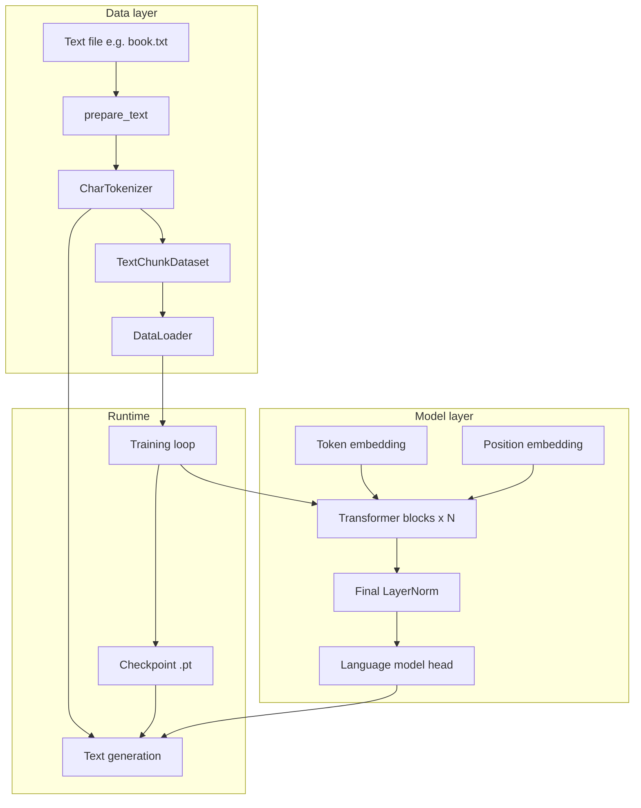
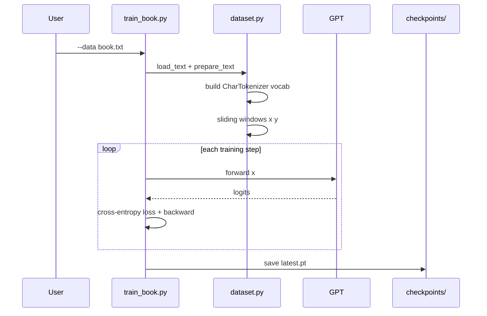
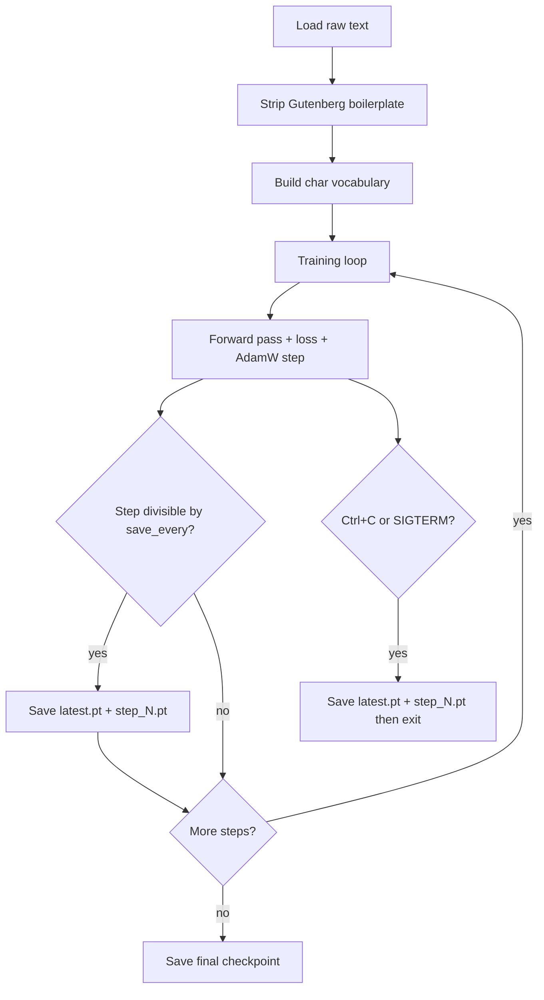
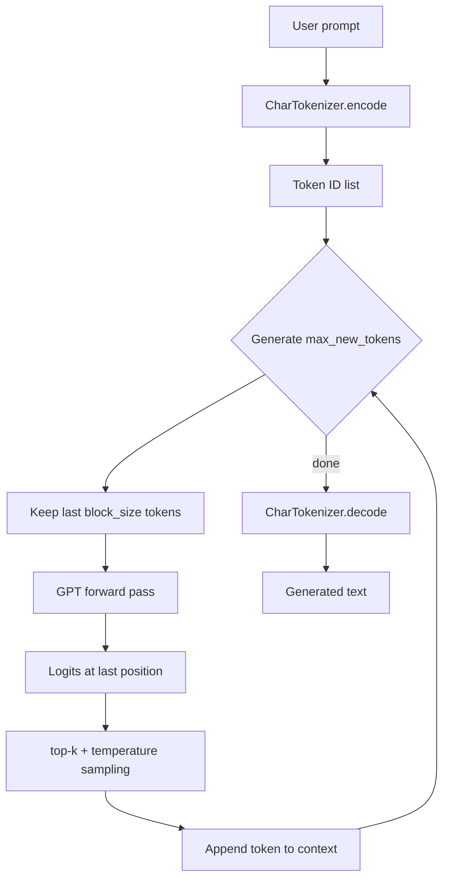
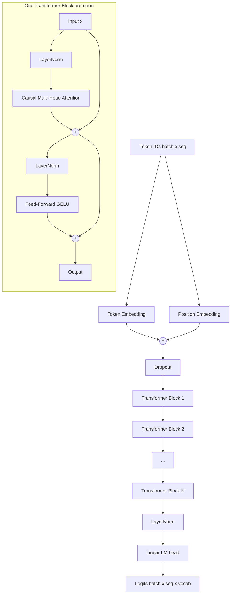
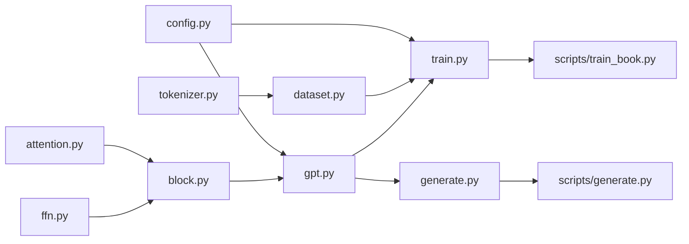
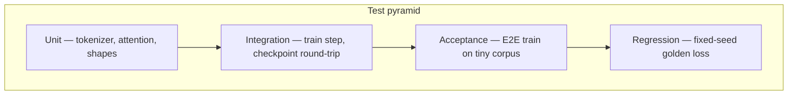

# Transformer Book Trainer

A simple, from-scratch **decoder-only GPT-style transformer** built with PyTorch. Train it on any book or plain-text file, then generate continuations character by character.

The project is organized for **progressive disclosure of complexity**: each module does one job, and the full model is assembled from small, readable pieces.

---

## Table of contents

- [How it works](#how-it-works)
- [Architecture overview](#architecture-overview)
- [Training pipeline](#training-pipeline)
- [Generation pipeline](#generation-pipeline)
- [Model internals](#model-internals)
- [Data pipeline](#data-pipeline)
- [Quick start](#quick-start)
- [CLI reference](#cli-reference)
- [Configuration](#configuration)
- [Project layout](#project-layout)
- [Testing](#testing)
- [Tips for better output](#tips-for-better-output)
- [Design principles](#design-principles)
- [License](#license)

---

## How it works

At a high level, the system learns to **predict the next character** given all previous characters in a fixed-size window.

```
  Input text:  "Call me Ishmael"
  Tokenized:   [C, a, l, l,   m, e, ...]
  Training:    given "Call me Ish"  → predict "m"
               given "all me Ishm"  → predict "a"
               ... (every position in every chunk)
  Generation:  start with a prompt, repeatedly predict one character at a time
```

This is **causal language modeling** — the same approach used by GPT models, but with a character-level vocabulary instead of subwords.

---

## Architecture overview



### End-to-end data flow



---

## Training pipeline



### What happens in one training step

1. Sample a batch of `(x, y)` pairs from the text.
   - `x` = 256 characters (input)
   - `y` = same sequence shifted by 1 (target / next character)
2. Run `x` through the GPT model → logits of shape `(batch, 256, vocab_size)`.
3. Compute cross-entropy between logits and `y`.
4. Backpropagate and update weights with AdamW.

### Sliding window example

For text `"hello"` with `block_size=4`:

```
Position:  0   1   2   3   4
Text:      h   e   l   l   o

Sample 0:
  x = [h, e, l, l]
  y = [e, l, l, o]
```

Each sample teaches the model to predict the next character at every position in the chunk.

---

## Generation pipeline



### Sampling options

| Mode | Flags | Behavior |
|------|-------|----------|
| Stochastic (default) | `--temperature 0.7 --top-k 40` | Sample from top 40 likely chars, scaled by temperature |
| Greedy | `--greedy` | Always pick the highest-probability character |
| Custom | `--temperature 1.0 --top-k 80` | More random, wider candidate pool |

Lower temperature → more conservative, repetitive output.  
Higher temperature → more creative, but less coherent if the model is under-trained.

---

## Model internals

The GPT model is a stack of identical **transformer blocks** with **causal (masked) self-attention**, so each character can only attend to itself and characters before it — never the future.

### GPT block diagram



### Causal attention mask

The attention matrix is masked so position `i` cannot look at positions `j > i`:

```
        t0  t1  t2  t3
  t0  [ 1   0   0   0 ]
  t1  [ 1   1   0   0 ]
  t2  [ 1   1   1   0 ]
  t3  [ 1   1   1   1 ]
```

This is what makes the model suitable for **autoregressive generation** — it never cheats by peeking at future characters during training.

### Default model hyperparameters

| Parameter | Default | Meaning |
|-----------|---------|---------|
| `d_model` | 128 | Embedding / hidden dimension |
| `n_heads` | 4 | Attention heads (`head_dim = 32`) |
| `n_layers` | 4 | Stacked transformer blocks |
| `block_size` | 256 | Max context length (characters) |
| `dropout` | 0.1 | Regularization during training |
| `vocab_size` | auto | Number of unique characters in the text |

**Weight tying:** the token embedding matrix and the output (`lm_head`) layer share the same weights — a standard GPT trick that reduces parameters and improves learning.

---

## Data pipeline


### Character tokenizer

- Vocabulary = every unique character in the training text (letters, digits, punctuation, whitespace, newlines).
- `encode("hello")` → list of integer IDs
- `decode([...])` → original string (lossless round-trip)

### Gutenberg stripping

If the file contains Project Gutenberg markers, boilerplate is removed automatically:

```
*** START OF THE PROJECT GUTENBERG EBOOK ... ***
  → keep only text between START and END markers
*** END OF THE PROJECT GUTENBERG EBOOK ... ***
```

Disable with `--no-strip-gutenberg` if you want to train on the full raw file.

---

## Quick start

### 1. Install

```bash
pip install -e ".[dev]"
```

Requires Python 3.10+ and PyTorch 2.0+.

### 2. Add training data

Place your text at `data/book.txt`, or pass any path via `--data`.

### 3. Train

Full training (default **3 epochs**):

```bash
python scripts/train_book.py --data data/book.txt --out checkpoints/
```

Quick trial on CPU (~1–2 hours):

```bash
python scripts/train_book.py --data data/book.txt --max-steps 5000
```

Training prints text length, vocab size, steps per epoch, and eval loss every 100 steps.

### 4. Generate

```bash
python scripts/generate.py --checkpoint checkpoints/latest.pt --prompt "Call me Ishmael."
python scripts/generate.py --checkpoint checkpoints/latest.pt --prompt "Call me Ishmael." --greedy
```

### 5. Test

```bash
pytest
```

---

## CLI reference

### `scripts/train_book.py`

| Argument | Default | Description |
|----------|---------|-------------|
| `--data` | *(required)* | Path to training text file |
| `--out` | `checkpoints` | Directory for saved checkpoints |
| `--resume` | *(none)* | Resume from a checkpoint (e.g. `checkpoints/latest.pt`) |
| `--save-every` | `500` | Save `latest.pt` and a numbered checkpoint every N steps |
| `--epochs` | `3.0` | Full passes over the text |
| `--max-steps` | *(auto)* | Fixed step count; overrides `--epochs` |
| `--batch-size` | `32` | Batch size |
| `--block-size` | `256` | Context window (characters) |
| `--d-model` | `128` | Model dimension |
| `--n-heads` | `4` | Attention heads |
| `--n-layers` | `4` | Transformer layers |
| `--lr` | `3e-4` | Learning rate |
| `--device` | `cuda` or `cpu` | Auto-detects GPU |
| `--strip-gutenberg` / `--no-strip-gutenberg` | on | Strip Gutenberg header/footer |

### `scripts/generate.py`

| Argument | Default | Description |
|----------|---------|-------------|
| `--checkpoint` | *(required)* | Path to `.pt` checkpoint |
| `--prompt` | `""` | Starting text |
| `--max-new-tokens` | `200` | Characters to generate |
| `--temperature` | `0.7` | Sampling temperature |
| `--top-k` | `40` | Limit sampling to top-k logits |
| `--greedy` | off | Greedy decoding (temperature = 0) |
| `--device` | `cpu` | Inference device |

### Checkpoint contents

Checkpoints are saved **every `--save-every` steps** (default 500), on **normal completion**, and when training is **interrupted** (Ctrl+C or SIGTERM).

```
checkpoints/
├── latest.pt          # always the most recent save (use for generate / resume)
├── step_000500.pt     # numbered snapshot at step 500
├── step_001000.pt     # numbered snapshot at step 1000
└── ...
```

Each `.pt` file stores:

```
├── model_state      # GPT weights
├── model_config     # architecture hyperparameters
├── tokenizer        # char ↔ id mappings
├── optimizer_state  # for resuming training
├── step             # completed training steps
├── max_steps        # target step count
└── eval_loss        # eval loss at save time
```

**Resume after an interrupt:**

```bash
python scripts/train_book.py --data data/book.txt --resume checkpoints/latest.pt
```

To extend training beyond the original target, pass a higher `--max-steps`:

```bash
python scripts/train_book.py --data data/book.txt --resume checkpoints/latest.pt --max-steps 20000
```

---

## Configuration

Configs live in `src/transformer/config.py` as dataclasses:

```python
ModelConfig(vocab_size, d_model, n_heads, n_layers, block_size, dropout)
TrainConfig(lr, batch_size, max_steps, eval_interval, device)
```

### Training time estimates (CPU, Moby Dick ~1.2M chars)

| Setting | Steps | Approx. time | Quality |
|---------|-------|--------------|---------|
| `--max-steps 1000` | 1,000 | ~10 min | Poor — not enough data seen |
| `--max-steps 5000` | 5,000 | ~1.5 hr | Some structure, still noisy |
| `--epochs 1` | ~38,000 | ~6–7 hr | Decent char-level prose |
| `--epochs 3` (default) | ~115,000 | ~18–20 hr | Best results on CPU |

Char-level models need **many passes** over the text. If output is gibberish, the model is almost certainly under-trained.

---

## Project layout

```
transformer_model/
├── pyproject.toml              # package deps and pytest config
├── README.md
├── license.md                  # MIT License
├── data/
│   └── book.txt                # your training text (not committed)
├── checkpoints/
│   └── latest.pt               # saved after training
├── src/transformer/
│   ├── config.py               # ModelConfig, TrainConfig
│   ├── tokenizer.py            # CharTokenizer
│   ├── dataset.py              # load, prepare, sliding-window dataset
│   ├── model/
│   │   ├── attention.py        # causal multi-head self-attention
│   │   ├── ffn.py              # feed-forward network
│   │   ├── block.py            # pre-norm transformer block
│   │   └── gpt.py              # full GPT model
│   ├── train.py                # loss, train step, checkpoint I/O
│   └── generate.py             # autoregressive sampling
├── scripts/
│   ├── train_book.py           # training CLI
│   └── generate.py             # generation CLI
└── tests/
    ├── conftest.py             # shared fixtures
    ├── unit/                   # isolated component tests
    ├── integration/            # wired-together tests
    ├── acceptance/             # end-to-end train + generate
    └── regression/             # fixed-seed golden loss values
```

### Module responsibilities



---

## Testing

Tests follow a **four-layer pyramid**:



| Layer | Directory | What it verifies |
|-------|-----------|------------------|
| **Unit** | `tests/unit/` | Tokenizer round-trip, attention mask, tensor shapes |
| **Integration** | `tests/integration/` | Gradients flow, checkpoint save/load |
| **Acceptance** | `tests/acceptance/` | Loss decreases on tiny text, generation returns output |
| **Regression** | `tests/regression/` | Exact loss values with `seed=42` to catch silent drift |

Run all tests:

```bash
pytest
pytest -v                    # verbose
pytest tests/unit/           # unit tests only
```

---

## Tips for better output

1. **Train long enough.** For a full book on CPU, aim for at least 1 epoch (`--epochs 1`), ideally 3 (the default).
2. **Use a book-style prompt.** Match the tone and opening words of your training text (e.g. `"Call me Ishmael."` for Moby Dick).
3. **Try `--greedy` first** when evaluating an under-trained model — sampling adds noise.
4. **Watch eval loss.** It should steadily decrease. If it plateaus above ~2.0, train longer or consider a slightly larger model (`--d-model 256 --n-layers 6`).
5. **Strip boilerplate.** Keep `--strip-gutenberg` on for Project Gutenberg files so the model learns prose, not license text.

---

## Design principles

- **Simplicity first** — char-level tokens, no BPE, no distributed training in v1.
- **Progressive disclosure** — attention → block → GPT → train → generate, one file per concept.
- **Maintainability** — config dataclasses, small public API, full test pyramid.
- **Readable top-to-bottom** — follow the data from `config.py` through `generate.py`.

### Planned future enhancements (not in v1)

- Subword (BPE) tokenization
- KV-cache for faster generation
- Learning rate warmup / cosine schedule
- Resume training from checkpoint (via `--resume`)

---

## License

This project is licensed under the [MIT License](license.md).

Copyright (c) 2026 Shubham Agarwal.
